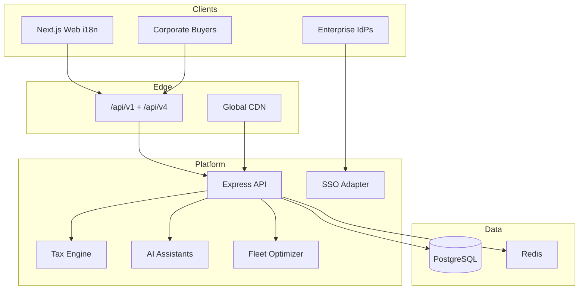

# Foodiq Version 4.0 — Enterprise Readiness Report

**Version:** 4.0.0 (Foundation)  
**Date:** 2026-07-18  
**Scope:** Enterprise & global expansion scaffolding  
**UI redesign:** None

---

## 1. Executive summary

Foodiq 4.0 builds on the 3.0 multi-tenant foundation to deliver an **enterprise/global expansion layer**: i18n, tax engine, SSO adapters, corporate ordering, AI assistant stubs, fleet/IoT hooks, API marketplace, and compliance APIs. Production IdP apps, certified PCI AOC, live multi-region failover, and trained LLMs remain **phased (4.1–4.3)**.

---

## 2. Architecture

---

## 3. Requirement matrix (all 26)

| # | Requirement | Status | Foundation deliverable |
|---|-------------|--------|------------------------|
| 1 | Internationalization (i18n) | Foundation | `i18nService` + `lib/i18n` catalogs |
| 2 | Multi-language Support | Foundation | Locales `en`, `hi`, `ar` + `resolveLocale` |
| 3 | Multi-currency Payments | Foundation | FX + `MULTI_CURRENCY_PAYMENTS` flag (default off) |
| 4 | Multi-timezone Support | Foundation | `formatInTimezone` + market/user IANA zones |
| 5 | Global Tax & GST/VAT Engine | Foundation | `taxEngine` + `tax_rules` (flagged) |
| 6 | AI Voice Ordering | Foundation | Heuristic transcript → intent parser |
| 7 | AI Customer Support Chatbot | Foundation | FAQ chatbot + `ai_chat_sessions` |
| 8 | Smart Restaurant Recommendations | Foundation | `recommendationService` heuristic |
| 9 | Personalized AI Offers | Foundation | `personalizedOffersService` |
| 10 | Enterprise SSO | Foundation | Google/Microsoft/Apple adapter stubs |
| 11 | Enterprise Role Management | Foundation | `organization_memberships` roles |
| 12 | Corporate Ordering System | Foundation | `corporate_accounts` / `corporate_orders` |
| 13 | Scheduled & Recurring Orders | Foundation | `recurring_order_schedules` + run endpoint |
| 14 | Fleet Management Dashboard | Foundation | `fleet_vehicles` + `/admin/fleet` |
| 15 | Smart Delivery Route Optimization | Foundation | Nearest-neighbor multi-stop optimizer |
| 16 | IoT Kitchen Integration | Foundation | Devices + telemetry ingest |
| 17 | Predictive Inventory Management | Foundation | Reorder suggestions from forecast |
| 18 | Enterprise Reporting & BI | Foundation | Org-scoped `/api/admin/v4/bi/enterprise` |
| 19 | Public API Marketplace | Foundation | Listings + subscriptions |
| 20 | Third-party Integrations | Foundation | Marketplace types + V3 connector stubs |
| 21 | High Availability Architecture | Foundation | K8s multi-replica + V4 multi-region docs |
| 22 | Disaster Recovery Across Regions | Foundation | `docs/V4_MULTI_REGION.md` |
| 23 | Compliance (GDPR, PCI-DSS) | Foundation | Privacy APIs + `docs/V4_COMPLIANCE.md` |
| 24 | Enterprise Audit Logs | Foundation | Org-scoped audit export |
| 25 | Global CDN Optimization | Foundation | Edge cache notes + `CDN_ASSET_PREFIX` |
| 26 | Enterprise Readiness Report | Done | This document + canvas |

---

## 4. Feature flags (safe defaults)

| Env | Default | Effect when off |
|-----|---------|-----------------|
| `TAX_ENGINE_ENABLED` | false | Checkout uses legacy 5% GST path |
| `MULTI_CURRENCY_PAYMENTS` | false | Checkout currency stays INR path |
| `SSO_ENABLED` | false | Password JWT only |
| `AI_ASSISTANTS_ENABLED` | false | AI endpoints return disabled envelope |

---

## 5. API surface (additive)

| Surface | Auth | Purpose |
|---------|------|---------|
| `/api/v4/health` | Public | Versioned health |
| `/api/v4/i18n/messages` | Public | Locale message catalog |
| `/api/v4/sso/:provider/*` | Public | SSO start/callback stubs |
| `/api/v4/corporate/*` | JWT + org role | Corporate / recurring orders |
| `/api/v4/chat`, `/api/v4/voice` | JWT / optional | AI assistants |
| `/api/v4/recommendations`, `/api/v4/offers/personalized` | Optional JWT | Recs / offers |
| `/api/v4/fleet/optimize` | Admin / enterprise key | Route optimization |
| `/api/v4/iot/telemetry` | API key | Kitchen device ingest |
| `/api/v4/marketplace` | Public / key | API marketplace |
| `/api/v4/privacy/*` | JWT | GDPR export / delete request |
| `/api/admin/v4/*` | Admin JWT | Tax, BI, audit, fleet, AI stats |

Legacy `/api/*`, `/api/v1`, `/api/admin/v3` unchanged.

---

## 6. Phased roadmap

| Phase | Focus |
|-------|--------|
| **4.0 Foundation (this)** | Schema, stubs, flags, docs, AdminShell pages |
| **4.1 AI production** | Real ASR/LLM providers, trained recommenders |
| **4.2 SSO live** | Production Google/Microsoft/Apple OAuth apps |
| **4.3 Global HA & attestations** | Multi-region failover, PCI AOC, GDPR DPA tooling |

---

## 7. Related docs

- [V4 Compliance](V4_COMPLIANCE.md)
- [V4 Multi-Region](V4_MULTI_REGION.md)
- [OpenAPI v4](api/openapi-v4.yaml)
- [V3 Architecture](VERSION_3_ARCHITECTURE_REPORT.md)

---

## 8. Success criteria checklist

- [x] Report covers all 26 themes
- [x] Schema migrates idempotently
- [x] Feature flags default off (V3-compatible checkout/auth)
- [x] `/api/v4/health` works
- [x] No customer-facing UI redesign
